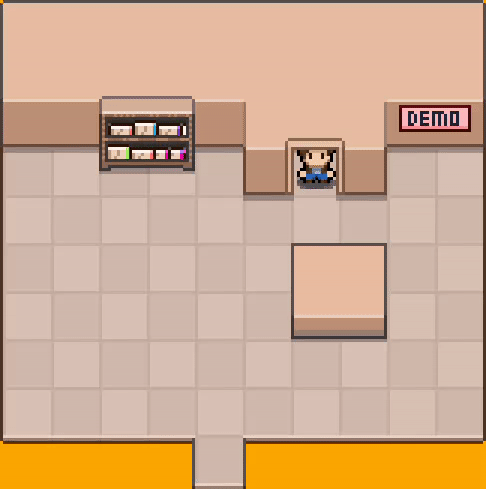

# Coderman 

Coderman is a 2D role-playing game in pixel art style. The story of this game is about a programmer called Coderman who fights with bugs with his superhero powers and destroys them and makes the applications continue to run.

**This project is currently under development 🚧🏗️**

# What's new in v0.1.0
- Rendering Map and Sprite
- Animation for Sprite
- Keyboard controller to controlling character movement

## Authors
Coderman is developed by [Soroush Shemshadi](https://github.com/shuoros) and [contributors](CONTRIBUTORS.md).

# Contribution
If you have any idea about the game or want to contribute on this project, Please read the [contribution guide](CONTRIBUTE.md).

## Releases
To see the changes in different versions of Coderman, you can read the [release notes](RELEASENOTES.md).

## Issues
If you encounter a bug or vulnerability, please read the [issue policy](ISSUES.md).
